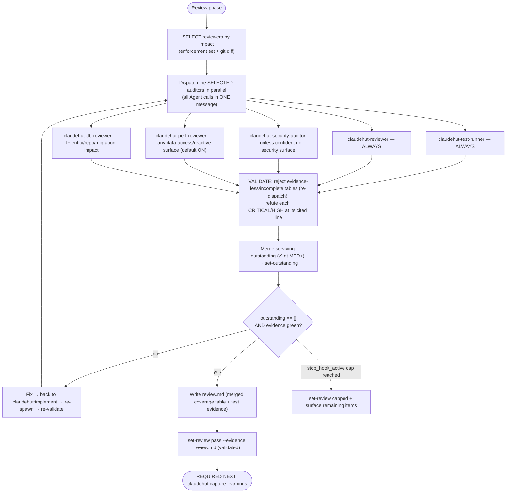

# Review (phase 6 of 7)

Prove the change is done — against the enforcement set, the project rules, and fresh test evidence — before
any completion claim. Run **inline on the main thread**: a subagent cannot spawn subagents, and this phase
dispatches five auditors in parallel.

## Iron Law

```
NO COMPLETION CLAIM WHILE ANY APPLICABLE SKILL, RULE, OR MEMORY ITEM IS UNSATISFIED — AND NONE WITHOUT FRESH REVIEW EVIDENCE
```

If you have not re-run the auditors **in this turn**, you cannot say it passes. This covers paraphrases too —
"should pass," "looks compliant," "probably fine" are all completion claims. The `Stop` gate blocks turn-end
until `review=pass`, and `set-review pass` now **requires the `review.md` evidence file** (see "Earned pass").

## Review rigor contract (binds the four CODE-REVIEW auditors — carried verbatim in each dispatch prompt)

Lenient review was the measured failure (code shipped with N+1s, missing `@Valid`, poor performance). The fix
is structural, not a pep talk. This contract binds the **code-review auditors — `claudehut-reviewer`,
`claudehut-security-auditor`, `claudehut-perf-reviewer`, `claudehut-db-reviewer`**; their dispatch prompts MUST
embed it and their bodies also carry it. **The `claudehut-test-runner` is exempt** — it gathers fresh test
evidence (raw command + pass/fail count), not a coverage table; its contract is "ran this turn, full output,
real counts".

1. **Think first.** Each code-review auditor runs `model: opus, effort: xhigh` and its prompt contains the
   literal token `ultrathink` — the only deep-reasoning keyword Claude Code recognizes (`think hard`/`think
   deeply` are plain text, ignored — Claude Code model-config docs). Reason about the change before judging.
2. **Refute, don't confirm.** You are a senior Java/Spring engineer whose sign-off decides whether this ships.
   Treat the change as **unproven until you cite evidence**. Judge code + diff + rules only — you are given no
   author, commit message, or "it's a quick fix" framing (confirmation-bias countermeasure). Report gaps that
   affect **correctness, the requirements, the rules, or performance** — not style nits `format-java.sh` owns.
   Do **not** manufacture findings to look thorough ("find ≥N" is banned — it produces false positives).
3. **Evidence per claim — both directions.** Every finding AND every "satisfied" attestation cites `file:line`
   and quotes the deciding code. A behavioral claim ("uses @EntityGraph", "input is validated") needs a
   `file:line` citation in the source — **never an inference from a name**. A bare "looks good / PASS" is a
   disqualified, non-answer.
4. **Coverage table — the output contract.** Return a table with **one row per enforcement-set item AND per
   item in your defect-class floor** (below), each → `✓ satisfied | ✗ violated | n-a` + evidence
   (`file:line` + quote, or `n-a: <one-line reason>`). Silence is not a pass: an item with no row = incomplete
   review, bounced back. **PASS is allowed only when every row is `✓` or `n-a`, each with evidence.**
5. **Severity scale (shared — drives blocking):**

   | Severity | Meaning | Gate |
   |---|---|---|
   | **CRITICAL** | correctness / security / data-integrity defect | **blocks** |
   | **HIGH** | rule violation, real bug, perf regression on a hot path | **blocks** |
   | **MED** | should-fix; risk or smell | **blocks unless explicitly justified + deferred** in `review.md` |
   | **LOW** | advisory polish | non-blocking |

   Confidence is not severity: an unproven-but-plausible N+1 on a request path is **HIGH**, not LOW — escalate by
   impact, then verify. Outstanding = every `✗` at MED or above not yet justified-and-deferred.

## Flow



## The loop

1. **Select the reviewers this change actually needs, then spawn them in parallel.** Dynamic selection
   (Issue 2): spawning a specialist with nothing to review wastes tokens + time (e.g. db-reviewer on a no-DB
   change). There is no native "reviewer selector" — *you* decide which Agent calls to issue, from two
   signals: the **enforcement set** (recorded in Brainstorm — its rules map to reviewers) and the **changed
   files**. **Fast-lane tasks (trivial/small tier) skipped Brainstorm and have NO enforcement set — select
   from the changed files alone**, applying the same asymmetry below. Get the changed files first:

   ```
   git diff --name-only $(git merge-base HEAD @{u} 2>/dev/null || echo HEAD~1)..HEAD; git status --porcelain
   ```

   | Reviewer | Spawn when | Asymmetry |
   |---|---|---|
   | `claudehut:claudehut-test-runner` | **always** | evidence is non-negotiable |
   | `claudehut:claudehut-reviewer` | **always** | correctness/conventions apply to any change |
   | `claudehut:claudehut-security-auditor` | **full tier:** enforcement has `security/*` **OR** diff touches controllers/auth/security/deserialization/secrets — skip ONLY on a confident no-security-surface read. **trivial/small tier: SKIP by default** — the write gate's fast-lane bound already **deterministically denied** any diff touching a security/auth/migration path (`fastlane_bound_ok`), so a fast-lane diff cannot contain that surface; spawn the auditor only if the diff somehow touches a controller/deserialization path anyway | **full tier over-include**: a false-skip ships a vulnerability (the `permitAll()` precedent); when in doubt, run it. The fast-lane skip is gate-backed, not judgment-backed |
   | `claudehut:claudehut-perf-reviewer` | enforcement has `performance/*` **OR** the diff touches ANY repository/`@Query`/entity/loop-over-a-finder/`Mono`/`Flux`/`@Cacheable` — i.e. anything data-access or reactive. **Default to spawning it** | **over-include**: the common Java/Spring defects (N+1, EAGER fetch, `.block()` in reactive) hide in "pure logic" diffs — a false-skip ships the regression. Skip ONLY a diff with zero data-access/reactive surface |
   | `claudehut:claudehut-db-reviewer` | enforcement has `framework/jpa`·`flyway`·`migration` OR diff touches `@Entity`/repository/migration files | the acceptance example: a **no-DB change does NOT spawn db-reviewer** |

   **Fast-lane fan-out reduction (trivial/small tier — audit B.3, cost):** a ≤2-file, non-sensitive change
   does not justify a separate test-runner dispatch on top of the reviewer. In trivial/small tier, **fold the
   test run into `claudehut-reviewer`** — its dispatch prompt adds "run the suite fresh this turn (cheapest
   test that proves the behavior); include the exact command + real pass/fail counts in your report," and you
   **do NOT spawn `claudehut-test-runner` separately**. One opus reviewer + (only if the diff warrants) one
   specialist, instead of reviewer + test-runner + specialists. The evidence bar is unchanged: `review.md`
   still needs the test-run summary, now carried by the reviewer. Full tier keeps the dedicated test-runner.

   Then **issue all the SELECTED Agent calls in ONE message** (native concurrency — same-message calls run
   concurrently; read-only, so conflict-free). Dispatch by **qualified type** (`claudehut:claudehut-…`) —
   unqualified names can fail to resolve and waste a full dispatch round (measured). State which reviewers you
   selected and why (one line each) so any skip is auditable.

   **Every dispatch prompt MUST carry (the subagent inherits `.claude/rules/` via project memory — and those
   path-scoped rules auto-load when the auditor Reads the changed files, promoted pitfalls included — but the
   following are NOT auto-present in its isolated context):**
   - **The Review rigor contract** (the numbered block above) verbatim, plus the auditor's defect-class floor.
     (The `test-runner` is exempt — its dispatch carries only "run the suite fresh this turn; report the exact
     command + real pass/fail counts"; it produces no coverage table.)
   - **Enforcement set, verbatim** —
     `jq -c '.enforcement_set' "${CLAUDE_PROJECT_DIR}/.claude/claudehut/state/${CLAUDE_SESSION_ID}.json"`.
     Auditors produce one coverage-table row per item; without it in the prompt they audit blind. (Fast-lane
     trivial/small tasks have an empty set — say so explicitly; the auditor falls back to its defect floor.)
   - **Project pitfalls / learnings** (RC-5 fix) — episodic learnings are NOT in a subagent's context. Run
     `"${CLAUDE_PLUGIN_ROOT}/scripts/inject-learnings.sh" --filter "<changed file names + enforcement keywords>" --top 8`
     on the main thread and paste the result under a `## Known pitfalls (check against these)` heading. The
     auditor must add a coverage row for each. (Promoted pitfalls already live in the rule files; this carries
     the un-promoted episodic ones.)
   - **Vocabulary table** — if `${CLAUDE_PROJECT_DIR}/.claude/claudehut/LANGUAGE.md` exists, read it on the
     main thread and paste it under a `## Project Vocabulary` heading. The `vocabulary.md` rule reaches the
     subagent, but the LANGUAGE.md table it points to does not. If absent, omit (do not block).

   Auditors that can use a database/Kafka MCP **degrade gracefully** when none is connected: they review
   statically (read code, infer query plans) instead of running live queries, and say so in their report.

2. **Validate the auditor reports before trusting them (refute pass — RC-2/RC-4).** The four code-review
   auditors returned coverage tables (the test-runner returned raw test output — validate it separately: it
   must show the command it ran this turn + real pass/fail counts, not an assertion). On the main thread,
   sanity-check — cheaply, no new dispatch needed:
   - **Reject incomplete coverage tables:** any code-review auditor whose table is missing a row for an
     enforcement-set item, or whose `✓ satisfied` rows lack a `file:line`+quote, or that returned a bare
     "PASS" → **re-dispatch it** with "your last report had no evidence for <item>; cite the source line or
     mark it ✗". A review without evidence is not a review.
   - **Refute blocking findings:** for each CRITICAL/HIGH, open the cited `file:line` and confirm the defect is
     real (drops auditor false positives) before it enters the outstanding set.
   For a large/high-stakes change, do the refute pass as a fresh `claudehut:claudehut-reviewer` dispatch told to
   *attack the other auditors' findings and passes* (the native fresh-context adversarial-review pattern); for
   ordinary changes the inline main-thread check above suffices.
3. **Merge the surviving outstanding items** (every `✗` at MED+ not justified-and-deferred):

   ```
   claudehut-state --session ${CLAUDE_SESSION_ID} set-outstanding '["framework/jpa.md: N+1 in OrderService — OrderService.java:42", "…"]'
   ```

4. If outstanding is non-empty → fix (loop back to `claudehut:implement`) → re-spawn the auditors **and re-run
   the validation pass**. Repeat until empty.
5. **Persist the review evidence** to the task dir —
   `${CLAUDE_PROJECT_DIR}/.claude/claudehut/tasks/NNNN-<slug>/review.md`. It MUST contain: the **merged
   coverage table** (every enforcement-set item + defect-class row → status + `file:line` evidence), the
   **test evidence** (the test-runner's exact command + pass count), any **MED deferrals with written
   justification**, and the final verdict. This is the file `set-review pass` validates.
6. **Earned pass (RC-4).** When outstanding == [] AND evidence is green:

   ```
   claudehut-state --session ${CLAUDE_SESSION_ID} set-review pass --evidence .claude/claudehut/tasks/NNNN-<slug>/review.md
   ```

   `set-review pass` now **requires `--evidence`** and refuses unless the file exists under `.claude/claudehut/`,
   contains a coverage table, and shows a test-run summary — `pass` is no longer a free-floating flag (mirrors
   the `tmpl()` validation already guarding spec/plan). Without rigorous evidence the gate stays closed.

## Test evidence (what the test-runner enforces)

Fresh evidence comes from the suite, picking the **cheapest test that proves the behavior**:

| Need | Use |
|------|-----|
| Pure logic, no Spring | plain JUnit 5 + Mockito (fastest) |
| Web layer only | `@WebMvcTest` (MVC) / `@WebFluxTest` (reactive) |
| Persistence only | `@DataJpaTest` / `@DataR2dbcTest` + Testcontainers |
| Full wiring / cross-cutting | `@SpringBootTest` (slowest — last resort) |
| External HTTP | WireMock (assert the request, not just stub the response) |
| Real DB / Kafka / Redis | Testcontainers — not embedded fakes or shared dev DBs |

No `Thread.sleep` for async — use Awaitility or `StepVerifier`. See `references/test-matrix.md` for the full
decision matrix and snippets.

## Exit condition

Exit when `outstanding == []` and evidence is green → `set-review pass --evidence <review.md>` (validated).
**OR** the native consecutive-`Stop` cap is reached (`stop_hook_active`) → `set-review capped` and surface the
remaining items to the user, rather than looping forever.

## Red flags — STOP

- "should pass" / "probably fine" / "looks compliant" before the auditors re-ran this turn
- Claiming done with a non-empty outstanding set
- An auditor coverage table with `✓ satisfied` rows that lack a `file:line`+quote, or missing rows (silence ≠ pass)
- A bare "looks good / PASS" from any auditor, or a behavioral claim inferred from a name instead of a cited line
- `set-review pass` without a `review.md` that carries the coverage table + test evidence
- Downgrading a plausible correctness/perf defect to LOW to avoid blocking (confidence ≠ severity)

**REQUIRED NEXT:** `claudehut:capture-learnings` (the Stop gate blocks "done" until Learn runs).
