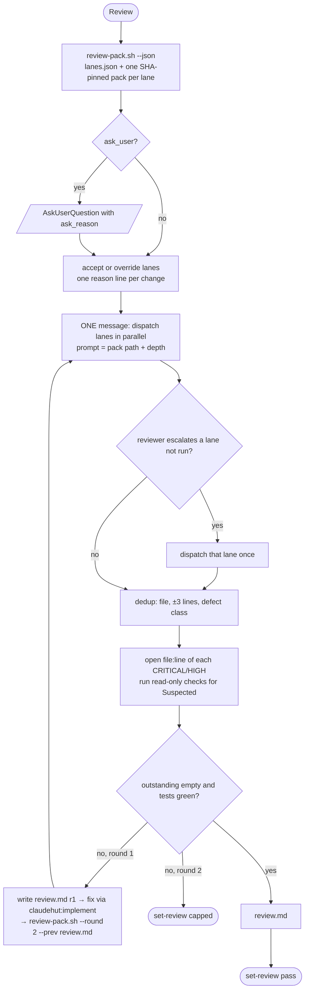

# Review (phase 6 of 7)

Prove the change is done against the enforcement set, the project rules and fresh test evidence. Runs on the
main thread: it picks the lanes, verifies findings and owns the `set-review` write. A pass needs auditors that
ran this turn and a `review.md` on disk; "should pass" is not evidence.

## Flow


```mermaid
flowchart TB
  s(["Review"]) --> pk["review-pack.sh --json<br/>lanes.json + one SHA-pinned pack per lane"]
  pk --> big{"ask_user?"}
  big -- yes --> ask[/"AskUserQuestion with ask_reason"/]
  big -- no --> sel["accept or override lanes<br/>one reason line per change"]
  ask --> sel
  sel --> fan["ONE message: dispatch lanes in parallel<br/>prompt = pack path + depth"]
  fan --> esc{"reviewer escalates a lane not run?"}
  esc -- yes --> add["dispatch that lane once"] --> ded
  esc -- no --> ded["dedup: file, ±3 lines, defect class"]
  ded --> ver["open file:line of each CRITICAL/HIGH<br/>run read-only checks for Suspected"]
  ver --> ok{"outstanding empty and tests green?"}
  ok -- "no, round 1" --> fix["write review.md r1 → fix via claudehut:implement<br/>→ review-pack.sh --round 2 --prev review.md"] --> fan
  ok -- "no, round 2" --> cap(["set-review capped"])
  ok -- yes --> rec["review.md"] --> pass(["set-review pass"])
```

## 1. Build the packs

Read the task first; the profile picks the branch below:

```
{ claudehut-state --session ${CLAUDE_SESSION_ID} status 2>/dev/null || echo '{}'; } | jq -c '.task // {} | {profile, enforcement_set}'
```

```
"${CLAUDE_PLUGIN_ROOT}/scripts/review-pack.sh" --json [--route light|full] [--task <id>]
```

The script computes the diff base (active task: `task.base[repo]` minus `pre_dirty`; no task: merge-base),
snapshots the tree without touching the index or worktree, and writes `lanes.json` plus one pack per lane
(≤1,500 lines) under `tasks/<id>/review/`, or a temp dir outside a workflow. Each pack's `## Rigor` section is
`references/review-rigor.md` copied verbatim; the pack also carries the lane's enforcement items, known
pitfalls, `## Summer KB` when the diff touches Summer wiring, and for the reviewer the vocabulary, reuse
suspects and (light route) the test command.

`lanes.json`: `{base, head_tree, lanes:[{lane, agent, reasons, depth, pack, lines}], skipped:[{lane, reason}], hints, ask_user, ask_reason}`.

Lane defaults by route: **light** → reviewer (tests folded in); **full** → reviewer + test; security, db
(incl. perf) and contract (incl. observability) only when a path or hunk signals them; enforcement items only ride in packs and `hints`.
**direct** → no review unless the user asks; then run it as an out-of-workflow review (below).

If the script is missing or prints no JSON, dispatch the reviewer (plus test-runner on full) with the changed
files from `git diff --name-only $(git merge-base HEAD @{u} 2>/dev/null || git merge-base HEAD origin/HEAD 2>/dev/null || git merge-base HEAD origin/main 2>/dev/null || echo HEAD~1)`,
and note `degraded` in `review.md`; likewise per lane on `degraded: true` or `pack: ""` (fallback file list, no pack).

**Profile branch:** on `audit`/`investigation` the deliverable is `findings.md`: dispatch the reviewer and the
security-auditor with the pack path plus the `findings.md` path, and skip the test lane unless the pack's files
include production code (`src/main/**`).

## 2. Select and dispatch

- Accept `lanes[]` as the default. Adding or dropping a lane is allowed; write one reason line per change.
- **`$ARGUMENTS` NARROWS, never widens:** named aspects (`security`, `db`, `contract`, `tests`; aliases
  `perf`→db, `observability`→contract) keep only those lanes plus the reviewer; with no argument the rule-driven selection above is unchanged.
- `ask_user: true` → AskUserQuestion once with `ask_reason` (typical options: split by paths | all lanes |
  reviewer + security). Also ask for a CRITICAL `pre-existing` finding (fix in this task or record
  separately) and for an `uncovered` file that an external plugin could review at real cost.
- Dispatch every selected lane in ONE message by qualified type (`claudehut:<agent>`), no `model` parameter.
  The prompt is the pack path and `depth: standard|deep` (the lane's `depth` in `lanes.json`: deep when it carries
  an enforcement item or security touches auth). Do not paste the diff; the pack holds it.
- **One test source per route:** full → the test lane (`claudehut-test-runner`), and the reviewer prompt adds
  "Do not run build/test". Light → no test-runner; the reviewer runs the pack's `## Test command`.
- **External lane (opt-in):** only for `uncovered` files or on user request, dispatch another plugin's
  agent/skill by its namespaced name; its findings enter the table as lane `ext:<name>` and go through the
  same dedup and verification.
- An auditor output without a Verdict (for example maxTurns reached) → mark the lane `incomplete`; do not
  re-dispatch it. Bounce only an output missing a Coverage row for an enforcement item of its own lane.
- A reviewer line `escalate: <lane> — File:NN` for a lane not run, or `partial` on a file in its `uncovered`
  (`lanes.json`) → dispatch that lane's agent once, the reviewer's pack path and escalate line as its focus.

## 3. Dedup and verify

1. **Dedup** on (file, ±3 lines, defect class); keep the highest severity and count reporters.
2. **Verify** on the main thread: open `file:line` for every CRITICAL/HIGH and confirm it before it enters
   outstanding.
3. **Pre-existing** is a verdict: tag it only when `git show <base>:<path>` has the same defect. A guard the diff
   removes or loosens stays a finding. Pre-existing does not block.
4. **Suspected:** run the read-only check yourself when the session has a matching MCP (DB, Kafka); otherwise
   record the item as inferred.
5. **Tie-break** only when you cannot decide: one `claudehut:claudehut-reviewer` with `mode: verify` and the
   whole candidate list, once. It counts against the 2-round cap.
6. **Reuse suspects:** each suspect in the reviewer's pack needs a resolution in its Coverage row (confirm as
   `✗`, or `resolved` / `false-positive: <reason>`); `set-review pass` refuses an unresolved one.
7. Merge surviving outstanding (every `✗` at MED+ not justified-and-deferred):

   ```
   claudehut-state --session ${CLAUDE_SESSION_ID} set-outstanding '["framework/jpa.md: N+1 in OrderService — OrderService.java:42"]'
   ```

## 4. review.md

Write `.claude/claudehut/tasks/NNNN-<slug>/review.md` with these sections:

- **Header line** — `round: N · base: <sha> · head_tree: <sha>` from `lanes.json`.
- **Lanes** — `| Lane | Agent | Run | Result | Reason |`; Run ∈ `ran | skipped | added | dropped | incomplete`,
  Result ∈ `PASS | OUTSTANDING (n) | —`. `review-pack.sh --prev` reads this table: lanes with
  `OUTSTANDING` carry into round 2. Write words here, not `✓`.
- **Findings** — `| Severity | file:line | Quote | Lane | Reporters | Status |`.
- **Coverage** — the merged rows: `| item | ✓ satisfied / ✗ violated | File.java:NN "quote" |`. Every `✓` row
  names a locus; the reviewer's floor rows keep this section non-empty on every route.
- **Pre-existing** · **Tests** (exact command and counts, e.g. `./gradlew test — 42 passed`) ·
  **Deferrals** (each MED with its justification) · **Verdict**.

## 5. Round 2 and exit

- Round 1 not clean: write `review.md` for round 1, fix through `claudehut:implement`, then
  `review-pack.sh --json --round 2 --prev <review.md> --base <round-1 head_tree>`. Its lanes are the lanes
  still `OUTSTANDING` plus the lanes the fix diff triggers (including new untracked `src` files); the test lane
  re-runs when the fix touches source. Dispatch those and rewrite `review.md` as round 2. Judge `pre-existing`
  against the round-1 header `base:`; a round-1 finding that still reproduces stays open.
- **Round cap — 2 rounds.** No third round: `set-review capped`, surface the surviving items and what was tried.

## Exit

`outstanding == []` and tests green →

```
claudehut-state --session ${CLAUDE_SESSION_ID} set-review pass --evidence .claude/claudehut/tasks/NNNN-<slug>/review.md
```

`set-review pass` refuses a `review.md` without a coverage table, a test line with counts, a locus on each `✓`
row, or a resolution for each reuse suspect. A task that skips Learn (a light task with nothing novel, or an
audit/investigation stopping at `set-findings`) ends here: `claudehut-state --session ${CLAUDE_SESSION_ID} end --status done`.

**Out-of-workflow review** (no active task, or a direct-route request the user asked to review): run
`review-pack.sh --json` without `--task`, dispatch as above, and return the findings in chat. No `review.md`,
no `set-review`.

## Test evidence

Judge the test choice against the **cheapest test that proves the behavior**, and reject a test that proves less
than it claims: Testcontainers rather than an embedded fake, `@SpringBootTest` only as a last resort, and no
`Thread.sleep` for async (Awaitility / `StepVerifier`).
**`references/test-matrix.md` is the ladder — read it before judging a test choice, and read the SLICE, not the whole file:** `references/test-matrix.md#web-slice-mvc`, `references/test-matrix.md#web-slice-webflux`, `references/test-matrix.md#async-without-sleep`.

**Java symbol lookups:** use the LSP tool (`findReferences`, `goToDefinition`), not grep — it finds the *symbol*, so it catches an implementation reached through an interface and ignores the name in a comment. Diagnostics are off here: build and tests stay the only signal for type errors.

## Red flags

- A completion claim before the lanes ran this turn, or with a non-empty outstanding set
- A `✓` row without a `file:line` and quote, a missing in-lane row, or a claim inferred from a name
- The diff pasted into a dispatch prompt, or two test sources on the full route
- Downgrading a plausible correctness or perf defect to LOW to avoid blocking

**Next:** `claudehut:capture-learnings` — unless the task ended at *Exit*.
