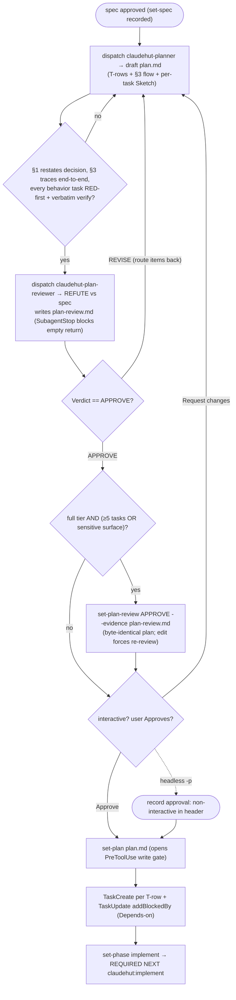

# Write Plan (Plan phase)

Convert the approved spec into an executable, test-first plan. Runs **inline on the main thread** — the planner
drafts in isolation; this skill owns the user gate, the state write, and the task mirror (a subagent cannot).

## Flow



## Process

1. **Dispatch `claudehut:claudehut-planner`.** Task dir is **derived from the recorded spec path** (`dirname` of
   the `set-spec` path) — never recompute `NNNN`. Inputs: spec, reuse-scan + brainstorm (same dir), template
   `references/plan-template.md`. It writes `…/tasks/NNNN-<slug>/plan.md`; it does NOT write state. (**`set-plan`
   REJECTS a plan with no `| T-xxx` rows**.)
2. **Dispatch `claudehut:claudehut-plan-reviewer`** — doc gate, BEFORE the user sees the plan; it **writes its
   coverage table + `Verdict: APPROVE|REVISE` to `tasks/NNNN-<slug>/plan-review.md`**. Loop on `REVISE`, then
   **record the verdict** (only the main thread writes state):
   ```
   claudehut-state --session ${CLAUDE_SESSION_ID} set-plan-review APPROVE --evidence .claude/claudehut/tasks/NNNN-<slug>/plan-review.md
   ```
   The wire that makes the reviewer fire: **`set-plan` REFUSES a full-tier plan that is substantial (≥5 tasks)
   OR touches a sensitive surface (security/auth/migration) unless `plan_review==APPROVE` is recorded for the
   byte-identical plan** (smart-gate; editing forces re-review via content-hash). Headless `-p`, no Agent budget:
   `claudehut-state set-bypass true` unblocks both set-plan and the write gate (note it in the plan header).
3. **Get approval (this opens the write gate — not before).** Interactive: **`AskUserQuestion`** with the
   decision + T-xxx list, **Approve** / **Request changes**. Non-interactive (`-p`): record `approval:
   non-interactive run — proceeded with draft` in the header. Only after approval (unlocks the `PreToolUse` gate):
   ```
   claudehut-state --session ${CLAUDE_SESSION_ID} set-plan .claude/claudehut/tasks/NNNN-<slug>/plan.md
   ```
4. **Mirror into the native task list**: one **`TaskCreate`** per T-xxx row (`subject: "T-001: <goal>"`,
   `description`: files + test-first + verify + req-ref, `activeForm`: present-continuous), then **`TaskUpdate
   addBlockedBy`** per Depends-on. `plan.md` stays the durable source of truth. Then enter Implement:
   `claudehut-state --session ${CLAUDE_SESSION_ID} set-phase implement`.

**REQUIRED NEXT:** `claudehut:implement` (test-first; the enforcement-set rules auto-load by path).
