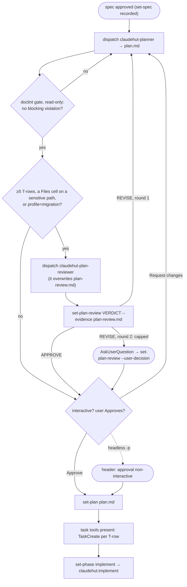

# Write Plan (Plan phase)

Convert the approved spec into the HOW: a test-first plan that references `AC-xxx`/`D-n` by ID. Runs
**inline on the main thread**: the planner drafts in isolation; this skill owns the gates, the state
writes and, where task tools exist, the task mirror.

## Flow


```mermaid
flowchart TB
    s(["spec approved (set-spec recorded)"]) --> draft["dispatch claudehut-planner → plan.md"]
    draft --> check{"doclint gate, read-only:<br/>no blocking violation?"}
    check -- "no" --> draft
    check -- "yes" --> smart{"≥5 T-rows, a Files cell on a sensitive path,<br/>or profile=migration?"}
    smart -- "no" --> ask
    smart -- "yes" --> rev["dispatch claudehut-plan-reviewer<br/>(it overwrites plan-review.md)"]
    rev --> rec["set-plan-review VERDICT --evidence plan-review.md"]
    rec -- "REVISE, round 1" --> draft
    rec -- "REVISE, round 2: capped" --> cap(["AskUserQuestion → set-plan-review --user-decision"])
    rec -- "APPROVE" --> ask{"interactive? user Approves?"}
    cap --> ask
    ask -- "Request changes" --> draft
    ask -. "headless -p" .-> bypass(["header: approval non-interactive"])
    ask -- "Approve" --> setplan["set-plan plan.md"]
    bypass --> setplan
    setplan --> mirror["task tools present: TaskCreate per T-row"]
    mirror --> phase["set-phase implement → claudehut:implement"]
```

## Process

1. **Dispatch `claudehut:claudehut-planner`** (no `name`). Task dir = `dirname` of the `set-spec` path. Put
   in the prompt: the spec, `context.md`, `reuse-scan.md` (and `brainstorm.md` when present), the template
   path `${CLAUDE_PLUGIN_ROOT}/skills/write-plan/references/plan-template.md`, and one line with the project
   language. It writes `tasks/NNNN-<slug>/plan.md` and no state. On a later pass, name the spec `rev`
   the plan must follow and the findings to address.
2. **Gate, read-only**: `${CLAUDE_PLUGIN_ROOT}/scripts/doclint.sh --json --kind plan --route full --profile <p> <plan.md>`.
   Blocking entries (missing heading, `java`/`kotlin` block, `spec-rev` ≠ spec `rev`, an AC in no Req cell)
   go back to the planner. Advisory word counts do not.
3. **Plan review, only on the predicate `set-plan` checks**: ≥5 `| T-` rows, or a T-row Files cell touching
   a sensitive path (the list in `claudehut-state`, e.g. `db/migration`, security or auth packages), or
   `profile=migration`. Below it, no dispatch and no verdict. When it holds, dispatch
   `claudehut:claudehut-plan-reviewer` with the plan, spec, template path
   `${CLAUDE_PLUGIN_ROOT}/skills/write-plan/references/plan-review-template.md`, the language line and the
   round (`plan_review_round` + 1 from `claudehut-state status`). Only the reviewer writes
   `plan-review.md`; the main thread does not edit it or write a verdict itself. Record what it wrote:
   ```
   claudehut-state --session ${CLAUDE_SESSION_ID} set-plan-review <APPROVE|REVISE> --evidence .claude/claudehut/tasks/NNNN-<slug>/plan-review.md
   ```
   The verdict must match the file's single `Verdict:` line. State counts rounds (`plan_review_round`, cap 2):
   REVISE on round 1 → back to the planner with the findings. REVISE on round 2 → `capped`; the command
   refuses until the user decides: take the findings and both attempts to `AskUserQuestion`, then re-run with
   `--user-decision "<the user's answer>"` (stored in `task.json`, round reset to 0).
4. **Approval.** Interactive: `AskUserQuestion` with the §1 Approach, the T-rows and the words/budget table
   from the `--json` `budget` block: **Approve** / **Request changes**. Non-interactive (`-p`): record
   `approval: non-interactive run — proceeded with draft` in the header. Then:
   ```
   claudehut-state --session ${CLAUDE_SESSION_ID} set-plan .claude/claudehut/tasks/NNNN-<slug>/plan.md
   ```
   `set-plan` re-runs the doclint gate and refuses a stale `spec-rev`.
5. **Task mirror, only with task tools** (`TaskCreate`/`TaskUpdate` are absent in many sessions; then skip):
   one `TaskCreate` per T-row, `TaskUpdate addBlockedBy` per Depends. `plan.md` stays the source of truth.
   Then `claudehut-state --session ${CLAUDE_SESSION_ID} set-phase implement`.

**Summer KB (when the project has `.claude/summer-kb/`):** every T-row whose Files touch Summer wiring carries
the spec's KB citation (`.claude/summer-kb/<module>.md §<section>`) in its Verify cell.

**Revision:** the plan is edited in place (`rev` +1, `## Changelog` line). When the spec's `rev` moves, the
planner updates the plan and its `spec-rev`; a plan-review pass then re-reads the whole plan.

**Next:** `claudehut:implement` (test-first; the enforcement-set rules auto-load by path).
