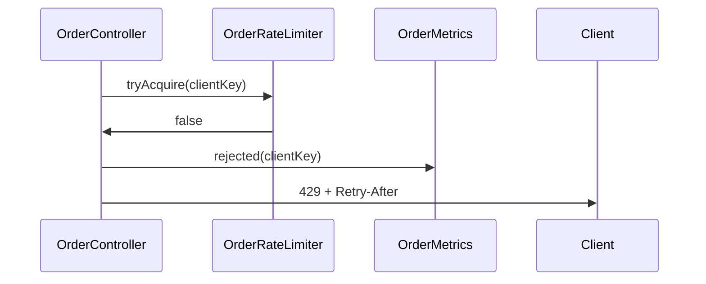

<!-- ch:grammar (read by scripts/doclint.sh; an artifact copies neither this comment nor the schema block)
Schema block: a line that starts with the comment opener followed by "ch:schema kind=<kind>" and optional
  totals "total=N" or "total.<profile|route>=N"; then one row per line; then the comment terminator alone.
Row: "[N. ]Heading | attr | attr". The artifact heading is "## " + "[N. ]Heading", compared after trimming
  spaces; a trailing HTML comment on the heading line is ignored. Rows are listed in document order. A
  "## " heading with no row is rejected; "### " subheadings are free.
attr: req=<list> names the profiles/routes that require the heading ("-" = optional, no req = always
  required); a listed heading is always allowed. budget=N caps the words of the section body (advisory).
  diagram=required needs a mermaid block or a line "n/a — <reason>" in the section (blocking).
  cells=Col:Nw,Col:Nc caps each cell of the table column whose header is exactly Col; w = words,
  c = bytes (advisory).
Words: tokens holding a letter or digit, ignoring table pipes, separator rows, mermaid and HTML comments.
  At language=vi every word cap is multiplied by 1.4. Heading comments repeat the schema numbers for the
  writer; the schema block is the source. -->
<!-- ch:schema kind=plan total.full=1500
1. Approach          | req=full | budget=80
2. Design            | req=full | budget=200 | diagram=required
3. Interfaces & Data | req=full | cells=Contract:25w
4. Tasks             | req=full | cells=Goal:12w,Test first:60c
5. Risks & Rollback  | req=full
Changelog            | req=-
-->
<!-- ch:budgets final after evals/doclint-replay.sh on 613 v0.11 artifacts (2026-09-30, 06 §10); c caps are bytes, no vi factor -->
<!-- Plan = HOW. Reference the spec's AC-xxx and D-n by ID; do not retell the spec. No java or kotlin code
     blocks: interface shapes go in the section 3 table, control flow in section 2 or in task notes.
     Copy from the "# Plan" line down to tasks/NNNN-slug/plan.md. spec-rev pins the spec rev this plan follows.
     Revision: edit in place, rev +1, one Changelog line per rev; re-read the spec when its rev moved. -->
# Plan: Rate-limit order creation
> id: 0001-order-rate-limit · spec-rev: 1 · route: full · rev: 1 · status: draft

## 1. Approach <!-- 80 words; which D-n this implements and its reuse anchor; no retelling of the spec context -->
Implements D-1: a per-client Resilience4j `RateLimiter` from the existing `RateLimiterConfig`, checked in
`OrderController` before the service call. Reuse anchor: Resilience4j (scan decision `adopt`); no hand-rolled
counter.

## 2. Design <!-- 200 words; sequenceDiagram, plus stateDiagram-v2 when there is state; prose only for races, transactions, idempotency -->

The check runs before the service transaction opens, so a rejected call writes nothing.

## 3. Interfaces & Data <!-- one row per changed element; Contract = Type#method(args): Ret, field:type, or a DDL summary; Req = AC IDs -->
| Element | Change | Contract | Req |
|---|---|---|---|
| `OrderRateLimiter` | new | `OrderRateLimiter#tryAcquire(clientKey: String): boolean` | AC-001 |
| `RateLimiterConfig` | extend | bean `orderLimiter`: 10 permits per 60 s | AC-001 |
| `OrderMetrics` | new | `OrderMetrics#rejected(clientKey: String): void`, counter `order.rate_limited` | AC-002 |

## 4. Tasks <!-- "### Phase N — name" subheadings, one table each; Files stays the 3rd column; Test first = ClassName#method (60 bytes); mark [P] on every task with no same-phase dependency and disjoint Files -->
### Phase 1 — limiter and metric
| ID | Goal | Files | Test first | Verify | Depends | Req |
|---|---|---|---|---|---|---|
| T-001 [P] | Add the per-client order limiter | src/main/java/app/order/OrderRateLimiter.java, src/test/java/app/order/OrderRateLimiterTest.java | OrderRateLimiterTest#rejectsEleventhCall | `./gradlew test --tests OrderRateLimiterTest` | — | AC-001 |
| T-002 [P] | Count rejected order requests | src/main/java/app/order/OrderMetrics.java, src/test/java/app/order/OrderMetricsTest.java | OrderMetricsTest#countsRejection | `./gradlew test --tests OrderMetricsTest` | — | AC-002 |

### Phase 2 — endpoint
| ID | Goal | Files | Test first | Verify | Depends | Req |
|---|---|---|---|---|---|---|
| T-003 | Return 429 from the order endpoint | src/main/java/app/order/OrderController.java, src/test/java/app/order/OrderControllerIT.java | OrderControllerIT#returns429OverLimit | `./gradlew test --tests OrderControllerIT` | T-001, T-002 | AC-001, AC-002 |
<!-- Task notes (optional): one or two sentences per task under its phase table, e.g. "T-003: map a false
     tryAcquire to 429 before the service call". -->

## 5. Risks & Rollback <!-- up to 5 lines -->
- Counters are per instance, so N instances admit N×10 per minute; accepted in D-1.
- Rollback: revert the PR; no data changes.
