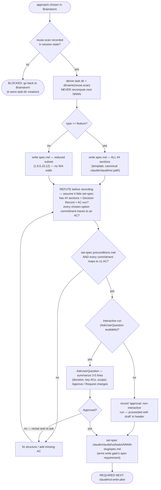

# Write Spec (Spec phase)

Turn the chosen approach into the **contract** the implementation and Review are graded on. Runs **inline on the main thread** — this skill owns a user gate (`AskUserQuestion`) and a state write (`claudehut-state`), which subagents cannot do.

## Flow



## Process

Derive the task dir from the recorded reuse-scan (`dirname` of `set-reuse-scan --artifact`) — never recompute "next NNNN". Write the spec from `references/spec-template.md` to the canonical path `${CLAUDE_PROJECT_DIR}/.claude/claudehut/tasks/NNNN-<slug>/spec.md` (never a bare `specs/` or `.claudehut/` path). Right-size by type: `feature` → all sections; `refactor`/`bugfix` → the reduced subset, no "N/A" walls. Use these exact `##` headings (full guidance in the reference):
`1. Problem & Context · 2. Goals / Non-Goals · 3. User Story · 4. Functional Requirements (EARS FR-xxx) ·
5. Acceptance Criteria (GWT AC-xxx) · 6. API Contract Changes · 7. Data Model Changes · 8. NFRs ·
9. Decision Record · 10. Out of Scope · 11. Open Questions · 12. Enforcement Manifest`
(reduced subset = 1, 9, 5, 10, 12). **`claudehut-state set-spec` REJECTS a file with no `## ` sections or no Decision Record** — a freeform spec will not arm the gate. **Only after approval** record it (do NOT run it before the user approves):

```
claudehut-state --session ${CLAUDE_SESSION_ID} set-spec .claude/claudehut/tasks/NNNN-<slug>/spec.md
```

Do NOT write production code yet — the write gate stays closed until a plan exists. **REQUIRED NEXT:** `claudehut:write-plan`.
