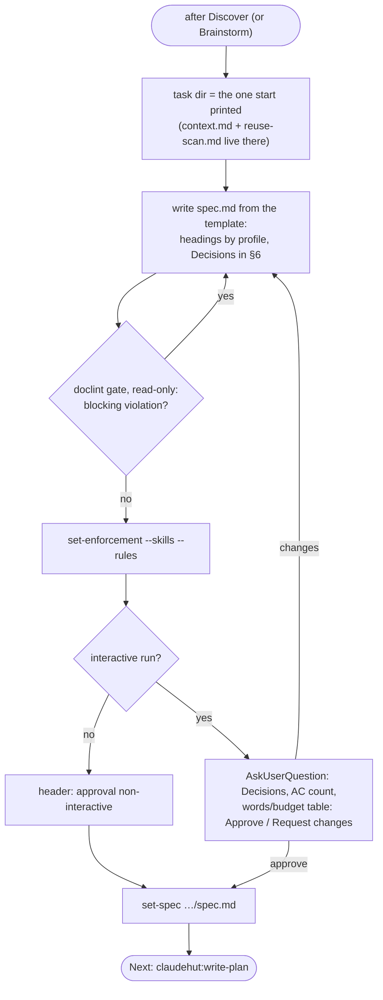

# Write Spec (Spec phase)

Turn the chosen approach into the **contract** the plan and Review are graded on: WHAT and WHY, observable
from outside. Beans, transactions, DDL and entities belong in the plan. Runs **inline on the main thread**:
it owns a user gate (`AskUserQuestion`) and a state write (`claudehut-state`).

## Flow


```mermaid
flowchart TB
  start(["after Discover (or Brainstorm)"]) --> dir["task dir = the one start printed<br/>(context.md + reuse-scan.md live there)"]
  dir --> write["write spec.md from the template:<br/>headings by profile, Decisions in §6"]
  write --> lint{"doclint gate, read-only:<br/>blocking violation?"}
  lint -- "yes" --> write
  lint -- "no" --> enf["set-enforcement --skills --rules"]
  enf --> mode{"interactive run?"}
  mode -- "no" --> nonint["header: approval non-interactive"]
  mode -- "yes" --> ask["AskUserQuestion: Decisions, AC count,<br/>words/budget table: Approve / Request changes"]
  ask -- "changes" --> write
  ask -- "approve" --> record
  nonint --> record["set-spec …/spec.md"]
  record --> done(["Next: claudehut:write-plan"])
```

## Process

1. **Write** `${CLAUDE_PROJECT_DIR}/.claude/claudehut/tasks/NNNN-<slug>/spec.md` from
   `${CLAUDE_PLUGIN_ROOT}/skills/write-spec/references/spec-template.md`: copy from `# Spec` down (the schema
   comments stay in the template). Headings stay English; the body follows the project language.
   Required headings by profile: `feature` → §1, 3, 4, 5, 6; `bugfix` → §1, 3, 6; `migration` → §1, 3, 6 and
   `## Rollback`. §2 and §7 are optional. Any other `##` heading is rejected.
   - §1 cites `file:line` or index nodes from `context.md` instead of retelling them.
   - §3: one row per behaviour, EARS sentence + GWT check in the same row, IDs `AC-001…`.
   - §6 Decisions: one Y-statement row per decision (`D-1…`, Status `accepted`). When Brainstorm ran, its
     recommendation becomes a D row and the header links `> options: tasks/NNNN-<slug>/brainstorm.md`;
     when it did not, the choice is written here directly.
   - No `java`/`kotlin` code blocks; other code blocks ≤12 lines; §4 needs a mermaid diagram or `n/a — <reason>`.
2. **Gate, read-only**, before asking:
   `${CLAUDE_PLUGIN_ROOT}/scripts/doclint.sh --json --kind spec --route full --profile <p> <spec.md>`.
   Fix every `blocking` entry. `advisory` entries (words over budget) are for the user to judge, not a stop.
3. **Enforcement set.** Record every skill and `.claude/rules/` file that plausibly applies to the change;
   Review audits against this set (its items ride in each lane's pack; lanes come from the diff's paths and hunks):

   ```
   claudehut-state --session ${CLAUDE_SESSION_ID} set-enforcement --skills <a,b> --rules <framework/jpa.md,…>
   ```
4. **Approval.** Interactive: `AskUserQuestion` with the §6 Decisions, the AC count and the words/budget
   table from the `--json` `budget` block: **Approve** / **Request changes**. Non-interactive (`-p`): record
   `approval: non-interactive run — proceeded with draft` in the header.
5. **Record** only after approval. `set-spec` runs the same doclint gate and refuses on a blocking violation:

   ```
   claudehut-state --session ${CLAUDE_SESSION_ID} set-spec .claude/claudehut/tasks/NNNN-<slug>/spec.md
   ```

**Summer KB (when the project has `.claude/summer-kb/`):** every AC row and decision that touches Summer
(`io.f8a.summer` wiring, `f8a.*`/`summer.*` properties, gates, `Ufid`/`Txid` annotations, Kafka contracts,
Summer types) cites `.claude/summer-kb/<module>.md §<section>`, uses only names that appear there, and the
enforcement set includes `--rules summer-kb.md`. A fact the KB cannot verify is written `[unverified]`.

## Revision (living document)

Edit `spec.md` in place: bump `rev`, add a `## Changelog` line (`rev N — change — reason
(owner|defect|discovery)`). A changed decision gets a new `D-k` row; the old row's Status becomes
`superseded-by D-k`, and its text stays. Headings for extra passes (Revision N, Round N) are rejected.
Re-run `set-spec`: it warns when the plan's `spec-rev` no longer matches, and the planner then updates the plan.

Production code waits for an approved plan. **Next:** `claudehut:write-plan`.
