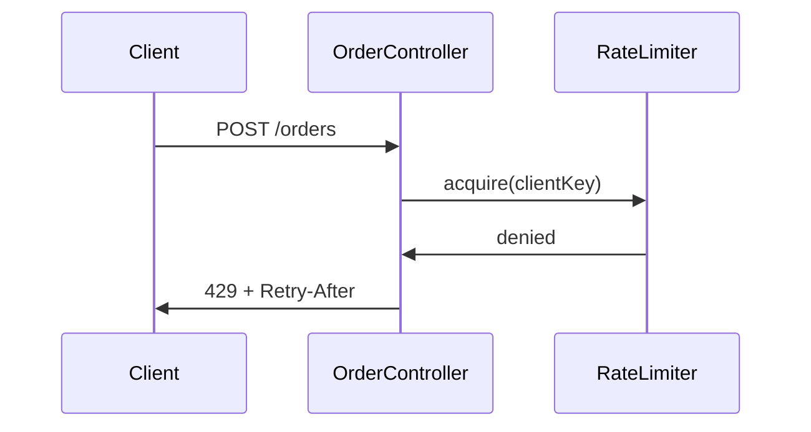

<!-- ch:grammar (read by scripts/doclint.sh; an artifact copies neither this comment nor the schema block)
Schema block: a line that starts with the comment opener followed by "ch:schema kind=<kind>" and optional
  totals "total=N" or "total.<profile|route>=N"; then one row per line; then the comment terminator alone.
Row: "[N. ]Heading | attr | attr". The artifact heading is "## " + "[N. ]Heading", compared after trimming
  spaces; a trailing HTML comment on the heading line is ignored. Rows are listed in document order. A
  "## " heading with no row is rejected; "### " subheadings are free.
attr: req=<list> names the profiles/routes that require the heading ("-" = optional, no req = always
  required); a listed heading is always allowed. budget=N caps the words of the section body (advisory).
  diagram=required needs a mermaid block or a line "n/a — <reason>" in the section (blocking).
  cells=Col:Nw,Col:Nc caps each cell of the table column whose header is exactly Col; w = words,
  c = bytes (advisory).
Words: tokens holding a letter or digit, ignoring table pipes, separator rows, mermaid and HTML comments.
  At language=vi every word cap is multiplied by 1.4. Heading comments repeat the schema numbers for the
  writer; the schema block is the source. -->
<!-- ch:schema kind=spec total.feature=1200 total.bugfix=500 total.migration=700
1. Context           | req=feature,bugfix,migration | budget=120
2. Goals & Non-Goals | req=-                         | budget=100
3. Requirements      | req=feature,bugfix,migration | cells=Requirement (EARS):40w,Acceptance (GWT):60w
4. Flow              | req=feature                  | budget=80 | diagram=required
5. Contracts         | req=feature                  | budget=150
6. Decisions         | req=feature,bugfix,migration | cells=Decision (Y-statement):80w,Rejected options:40w
7. Open Questions    | req=-                        | budget=60
Rollback             | req=migration
Changelog            | req=-
-->
<!-- Spec = WHAT/WHY seen from outside. Beans, transactions, DDL and entities belong in the plan. Copy from the
     "# Spec" line down to tasks/NNNN-slug/spec.md. Headings stay English; the body follows the project language.
     Header keys: profile feature|bugfix|migration · status draft|approved · add a line
     "> options: tasks/NNNN-slug/brainstorm.md" only when a brainstorm exists.
     Revision: edit in place, rev +1, one Changelog line per rev; a changed decision gets a new D-k row and the
     old row's Status becomes "superseded-by D-k". Headings for extra passes (Revision, Round, Addendum) are rejected. -->
# Spec: Rate-limit order creation
> id: 0001-order-rate-limit · profile: feature · route: full · rev: 1 · status: draft · date: 2026-09-30

## 1. Context <!-- 120 words. Problem, why now, reuse decision; cite file:line or index nodes from context.md instead of retelling. Bugfix: symptom, reproduction, suspected root cause. -->
One client can create orders without limit and starve the others during a sale (`OrderController#create`,
context.md). Reuse: the project already configures Resilience4j (`RateLimiterConfig.java:18`); the scan
decided `adopt`.

## 2. Goals & Non-Goals <!-- 100 words; optional -->
- Goal: each client is capped at 10 order requests per minute.
- Non-goal: a global limit across all clients; limits on read endpoints.

## 3. Requirements <!-- one row per behaviour: EARS sentence and its GWT check in the same row; AC IDs are permanent; a quality target is an EARS sentence without WHEN -->
| ID | Requirement (EARS) | Acceptance (GWT) |
|---|---|---|
| AC-001 | WHEN a client sends more than 10 order requests in one minute THE SYSTEM SHALL reject the request with HTTP 429 | GIVEN 10 accepted requests this minute WHEN the 11th arrives THEN HTTP 429 and no order row is written |
| AC-002 | THE SYSTEM SHALL count every rejected order request | GIVEN a rejected request WHEN metrics are scraped THEN `order.rate_limited` has grown by 1 |

## 4. Flow <!-- 80 words; mermaid flowchart or sequenceDiagram; two or more services add a container-level flowchart; or a line "n/a — <reason>" -->

## 5. Contracts <!-- 150 words; method + path, schema, error codes, backward compatibility; payload blocks up to 12 lines; or "none" -->
`POST /orders` is unchanged on success. New response `429 Too Many Requests`, header `Retry-After: <seconds>`,
body `{"code":"RATE_LIMITED"}`. Backward compatible: clients already handle 4xx.

## 6. Decisions <!-- one Y-statement per row; D IDs are permanent; Status is accepted or superseded-by D-k -->
| ID | Decision (Y-statement) | Rejected options | Confirmation | Status |
|---|---|---|---|---|
| D-1 | In the context of order creation, facing bursty clients, we decided for the existing Resilience4j RateLimiter keyed by client to achieve per-client fairness, accepting per-instance counters | Gateway limit (no client key); Redis counter (new dependency) | AC-001 test; review of `RateLimiterConfig` | accepted |

## 7. Open Questions <!-- 60 words; optional; at most 3 NEEDS CLARIFICATION markers, each with an owner; none left at approval unless tagged non-blocking -->
none
<!-- Profile migration adds "## Rollback" here: down path or forward fix, and what happens to written data.
     When rev > 1 add "## Changelog" last: one line per rev, "rev 2 — <change> — <reason: owner|defect|discovery>". -->
